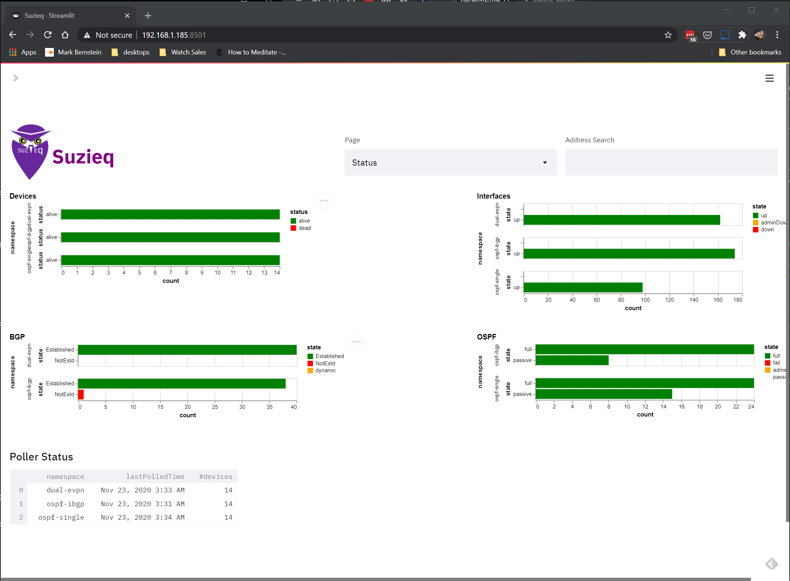
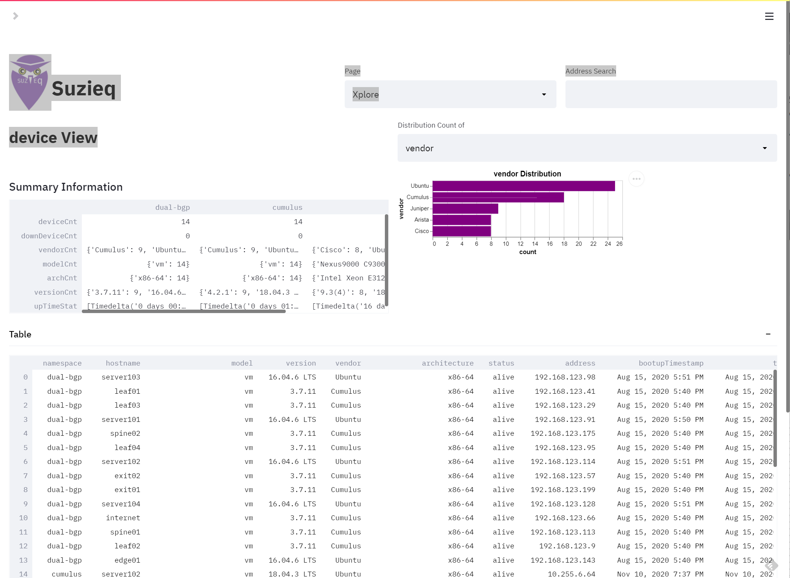
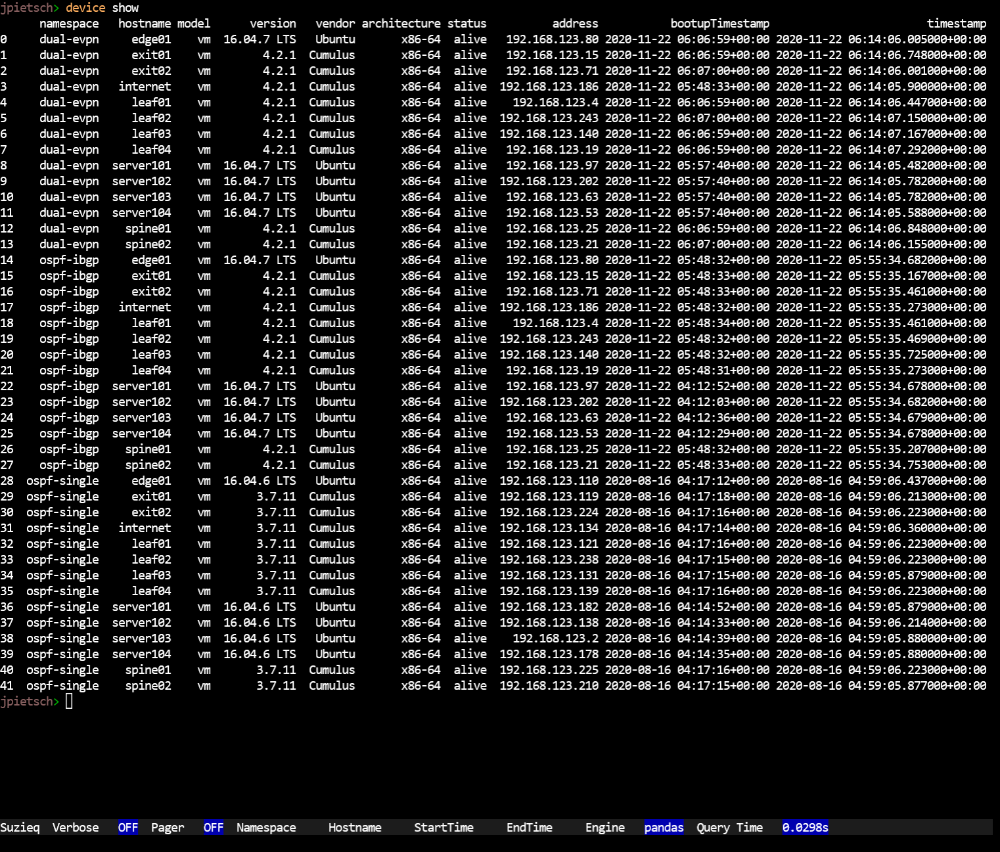
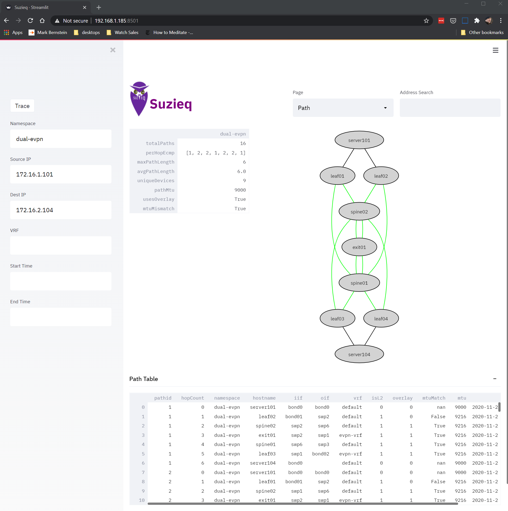
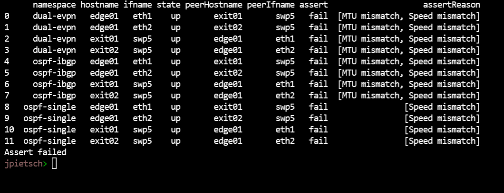

[](https://github.com/netenglabs/suzieq/actions/workflows/integration-tests.yml)
[](https://github.com/netenglabs/suzieq/releases/latest)
[](LICENSE)
[](https://hub.docker.com/r/netenglabs/suzieq/tags?page=1&ordering=last_updated)
[](https://hub.docker.com/r/netenglabs/suzieq/tags?page=1&ordering=last_updated)
[](https://hub.docker.com/r/netenglabs/suzieq/tags?page=1&ordering=last_updated)

# Suzieq -- Healthier Networks Through Network Observability

Would you like to be able to easily answer trivial questions such as how many unique prefixes are there in your routing table, or how many MAC addresses are there in the MAC tables across the network? How about more difficult questions, such as what changes did your routing table see between 10 pm and midnight last night, or which of your nodes have been up the longest, or which BGP sessions have had the most routing updates? How about being able to answer if your OSPF (or BGP) sessions are working correctly, or is all well with your EVPN? How about a quick way to determine the amount of ECMP at every hop between two endpoints? Do you wish you could easily validate the configuration you deployed across your network?

Do you login to every network node you have to figure out answers to a questions like these? Do you then struggle to piece the information together into a consistent whole across the various formats provided by various vendors? Do you wish you had an **open source, multi-vendor** tool that could help you answer questions like these and more?

If you answered yes to one or more of these questions, then Suzieq is a tool that we think will be interesting to you.  **Suzieq helps you find things in your network.**

**Suzieq** is both a framework and an application using that framework, that is focused on **improving the observability of your network**.  We define observability as the ability of a system to answer either trivial or complex questions that you pose as you go about operating your network. How easily you can answer your questions is a measure of how good the system's observability is. A good observable system goes well beyond monitoring and alerting. Suzieq is primarily meant for use by network engineers and designers.

Suzieq does multiple things. It [collects](https://suzieq.readthedocs.io/en/latest/poller/) data from devices and systems across your network. It normalizes the data and then stores it in a vendor independent way. Then it allows analysis of that data. With the applications that we build on top of the framework we want to demonstrate a different and more systematic approach to thinking about networks. We want to show how useful it is to think of your network holistically.

## Quick Start

### Using Docker Container

We want to make it as easy as possible for you to start engaging with Suzieq, so we have a demo that has data in including the the iamge.

* `docker run -it -p 8501:8501 --name suzieq netenglabs/suzieq-demo`
* `suzieq-cli` for the CLI OR
* `suzieq-gui` for the GUI. Connect to http://localhost:8501 via the browser to access the GUI

When you're within the suzieq-cli, you can run ```device unique columns=namespace``` to see the list of different scenarios, we've gathered data for.

Additional information about running the analyzer (suzieq-cli) is available via the official documentation page.

To start collecting data for your network, create an inventory file to gather the data from following the instructions [here](https://suzieq.readthedocs.io/en/latest/poller/). Decide the directory where the data will be stored (ensure you have sufficient available space if you're going to be running the poller, say 100 MB at least). Lets call this dbdir. Now launch the suzieq docker container as follows:

* ```docker run -itd -v <parquet-out-local-dir>:/suzieq/parquet -v <inventory-file>:/suzieq/inventory.yml --name sq-poller netenglabs/suzieq:latest```
* Connect to the container via ```docker attach sq-poller```
* Launch the poller with the appropriate options. For example, ```sq-poller -D inventory.yml -n mydatacenter``` where mydatacenter is the name of the namespace where the data associated with the inventory is stored and inventory.yml is the inventory file in Suzieq poller native format (Use -a instead of -D if you're using Ansible inventory file format).

### Using Python Packaging

If you don't want to use docker container or cannot use a docker container, an alternative approach is to install Suzieq as a python package. It is **strongly** recommended to install suzieq inside a virtual environment. If you already use a tool to create and manage virtual environments, you can skip the step of creating a virtual envirobment below.

Suzieq requires python version 3.7.1 at least, and has been tested with python versions 3.7 and 3.8. It has not been tested to work on Windows. Use Linux (recommended) or macOS. To create a virtual environment, in case you haven't got a tool to create one, type:

```bash
python -m venv suzieq
```

This creates a directory called suzieq and all suzieq related info is stored there. Switch to that directory and activate the virtual environment with:

```bash
source activate
```

Now the virtual environment is alive and you can install suzieq. To install suzieq, execute:

```bash
pip install suzieq
```

Once the command completes, you have the main programs of suzieq available for use:

* sq-poller: For polling the devices and gathering the data
* suzieq-gui: For launching the GUI
* suzieq-cli: For running the CLI
* sq-rest-server: For running the REST API server

[The official documentation is at suzieq.readthedocs.io](https://suzieq.readthedocs.io/en/latest/), and you can watch the screencasts about Suzieq on [Youtube](https://www.youtube.com/results?search_query=netenglabs).

# Analysis

Suzieq supports Analysis using CLI, GUI, REST API, and python objects. For the most part they are equivalent, though with the GUI we have combined the output of multiple commands of the CLI into one page.

The GUI has a  status page to let you know what the status of entitites in your network.


The Xplore page lets you dive into what is in your network. 

The CLI supports the same kind of analysis as the explore page. 

[More examples of the CLI can be seen in the docs and blog posts we've created.](https://suzieq.readthedocs.io/en/latest/analyzer/)

## Path

Suzieq has the ability to show the path between two IP addresses, including the ability to show the path through EVPN overlay. You can use this to see each of the paths from a source to a destination and to see if you have anything asymetrical in your paths. 

## Asserts

One of Suzieq's powerful capabilities are asserts, which are statements that should be true in the network. We've only just started on asserts; what Suzieq has now only demonstrates it's power, there's a lot more to be added in this space. 

# Suzieq Data

**Suzieq supports gathering data from Cumulus, EOS, IOS, IOSXE, IOSXR, JunOS(QFX, MX, EX, SRX supported), NXOS and SONIC routers, and Linux servers.** Suzieq gathers:

* Basic device info including serial number, model, version, platform etc.
* Interfaces
* LLDP
* MAC address table (VPLS MAC table for Junos MX)
* MLAG
* Routing table
* ARP/ND table
* OSPFv2
* BGP
* EVPN VNI info

We're addding support for more platforms and features with every release. See [the documentation](https://suzieq.readthedocs.io/en/latest/tables/) on details of specific tables and its NOS support.

We're also looking for collaborators to help us make Suzieq a truly useful multi-vendor, open source platform for observing all aspects of networking. Please read the [collaboration document](./CONTRIBUTING.md) for ideas on how you can help.

# Release Notes

The official release notes are [here](https://suzieq.readthedocs.io/en/latest/release-notes/).

# Engage

You can join the conversation via [slack](https://join.slack.com/t/netenglabs/shared_invite/zt-g64xa6lc-SeP2OAj~3uLbgOWJniLslA). Send email to suzieq AT stardustsystems.net with the email address to send the Slack invitation to.

# Additional Documentation & Screencasts

We've done some blogging about Suzieq:

* [Introducing Suzieq](https://elegantnetwork.github.io/posts/Suzieq/)
* [10ish ways to explore your network with Suzieq](https://elegantnetwork.github.io/posts/10ish_ways_to_explore_your_network_with_Suzieq/)
* [Questions to Suzieq](https://elegantnetwork.github.io/posts/10qa-suzieq/)
* [Time in Suzieq](https://elegantnetwork.github.io/posts/time-suzieq/)

We've also been adding screencasts on [Youtube](https://www.youtube.com/results?search_query=netenglabs).

# Suzieq Priorities

We don't have a roadmap, but we do have a list of our [priorities](https://github.com/netenglabs/suzieq/blob/master/docs/2020-priority.md). We mix this with the [issues reported](https://github.com/netenglabs/suzieq/issues).
