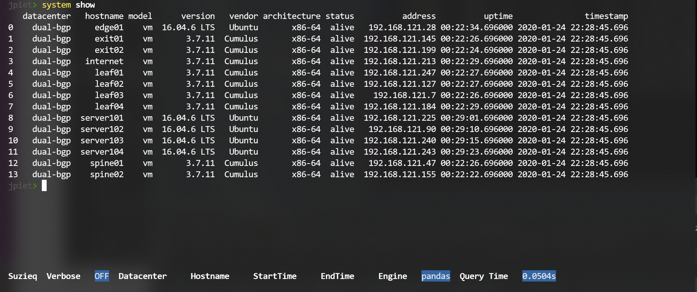
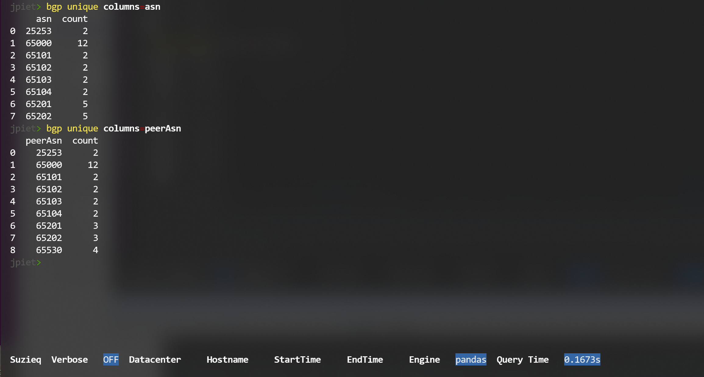
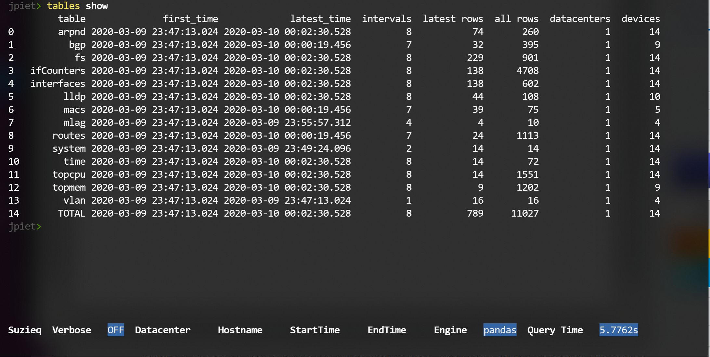
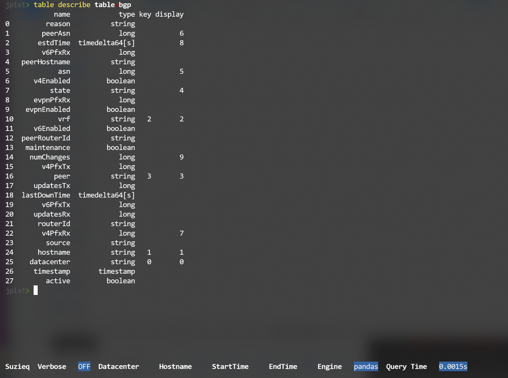

# Suzieq
Suzieq is an application focused on observability for IP networks: We want you to understand 
your network as a system. Suzieq gathers data and then allows analysis of the data in interesting ways.

Suzieq data is focused on [Pandas DataFrames](https://pandas.pydata.org/pandas-docs/stable/getting_started/dsintro.html)
Everything returned by the analysis engine is a dataframe.

We are just getting started; this is a very early release. We have many more ideas on what Suzieq can do, but we wanted to get this out
so that people can start using it. And start solving problems in their networks.

For now, all the analysis are in a CLI.

# Analysis
Let's jump into what you can do with Suzieq
```
python3 suzieq/cli/suzieq-cli
```
You get a prompt and at the bottom of the screen are some indicators of what Suzieq is up to:

The words in the bottom show specific choices that you can make to filter data.

To get started, it's often a good idea to look at the help. Just type a '?' to get started:

You see the commands that you can use with Suzieq. For each command there are a small number of verbs 
and some filters that you can add. Every command has at least the 'show','summary', and 'unique' verbs, some 
commands have more.

Let's look at the some data, we'll start with the system data, to get an overview of the system/nodes
that we have data for. This shows that we have data from 14 nodes and some information about each of
system.


Each command has completetion to help you understand what you can do with the command. 
For instance, interface command shows that it has five verbs that you can use with it.


Let's look quickly at BGP data. 


There's a lot of data there. We just want to look at the ASNs. Let's look at what the ASNs are and
how many there are of each.


A quick peak at routes, shows that there are 239 routes.


If you want to look at the database more directly, use the table command. There is not always
a single connection between tables in the database and commands that are available. Also, we are 
collecting data in some tables, such as ifCounters that we do not yet have commands for. 
We assume it's better to start getting data and then we can add useful analysis as we go along.

'table show' shows each table in the database and some statistics about each one. 

Suzieq only saves data to the database if there have been changes to the data. So some 
tables will iterate often, and some will not. 

For each table, you can look at what is in the data and what are the columns that are displayed automatically.
For instance, with BGP we collect a lot more data than we show by default. 


You can always display more columns by adding the columns filter at the end of a show command.
You can use 'columns=*' to get all the columns available for a command, but for bgp that is a lot!


# Getting Data
Two really important concepts in suzieq are Nodes and Services. Nodes are devices of some kind;
they are the object being monitored. Services are the data that is collected and consumed by suzieq. 
Service definitions describe how to get output from devices and then how to turn that into useful data.

Currently Suzieq  supports polling [Cumulus Linux](https://cumulusnetworks.com/) or
 [Arista](https://www.arista.com/en/) devices, as well as Linux. 
Suzieq can easily support other device types, we just haven't had access to those and not time to 
chase them down.
Adding new device types starts by created a new [Service](docs/service-file-format.md)
We can't really support this right now because we don't have enough good testing around all the different ways to configure services. 
Services work for what we have available, but we have not tested around the edges of services. 
They might just work for you, but if you run into trouble we can only help a little right now.

We started out with least common denominator SSH and REST access to devices. 

Suzieq does have support for agents to push data and we've done some experiments with them, but don't
have production versions of that code. 
# Polling data and getting started
Suzieq requires Python 3.7, so make sure that is installed first.

## Installation with Pipenv
The first way to install Suzieq is to get the code from github
1. git clone: `git clone git@github.com:ddutt/suzieq.git`
2. Suzieq assumes the use of python3.7 which may not be installed on your computer by default. 
Ubuntu 18.04 ships with 3.6 as default, for example. Check your python version with python3 --version. 
If that is different from 3.7, you’ll need to add the python3.7 and 3.7 dev package. 
But, until we can build the different engines separately, we’re stuck with this requirement. 
3. To install python3.7 on Ubuntu18.04, please execute the following command
    ```
    sudo add-apt-repository ppa:deadsnakes/ppa
    sudo apt install python3.7 python3.7-dev
    ```
4. Install python3-pip if it has not been installed.
    ```
    sudo apt install python3-pip
    ``` 
5. Install pipenv
    ```
    pip3 install --user pipenv
    ```
6. Install suzieq requirements and setup the virtual environment necessary for suzieq
    ```
    cd suzieq
    pipenv install
    ```
7. Once pipenv finishes, you execute `pipenv shell` to login to the virtualenv that suzieq 
will execute in. 
8. Install cyberpandas -- TODO: 
9. TODO What to do about nubia bug 

Suzieq requires that you have a suzieq config file either in '/.suzieq/suzieq-cfg.yml' or '/.suzieq-cfg.yml'.
It looks like:
```
data-directory: /home/jpiet/parquet-out
service-directory: /home/jpiet/suzieq/config
schema-directory: /home/jpiet/suzieq/config/schema
temp-directory: /tmp/suzieq
logging-level: WARNING
```
You need to make sure that service-directory and schema-directory point to the actual code or nothing will work.
## Polling
The poller needs a [list of devices](docs/hosts-file-format.md) to poll. 
If you have a vagrant inventory, we have a utility to read that data and turn it into the file format
that Suzieq needs. 
```
sudo python suzieq/genhosts.py ~/cloud-native-data-center-networking/topologies/dual-attach/.vagrant/provisioners/ansible/inventory/vagrant_ansible_inventory dual-bgp dual
```

After installing all the requirements, starting the poller is easy

`python3 suzieq/poller/sq-poller.py -f -H ~/dual-bgp`

# Database and Persistence of data
Because everything in Suzieq revolves around dataframes, it can support different persistence engines underneath. 
For right now, we only support our own, which is built on [Parquet](https://parquet.apache.org/) files. This is setup should be fast enough
to get things going and for most people. We have tried other storage systems, so we know it can work, but none
of that code is production worthy. As we all gain experience we can figure out what the right persistence engines are

One of the advantages is that the data are just files that can easily be passed around. There is no database code
that must be running before you query the data. 


# How time works in suzieq
By default when you use the CLI and you use a command, you will be using 'view=latest'. This is usually
the most useful and what you expect to see. If you want to see all your data, add 'view=all'

# What Can I do with Suzieq
The point and beauty of Suzieq is to get data from your whole system in one place,  to get all 
the data together and to have it over time. Because of this, we can then do more analysis that 
is very hard to do. At this point we don't have a lot of that analysis, we've been focusing on 
getting the core foundations strong.

The path command is probably the best example at this point of gathering the data from all the devices
as well as the data from multiple device commands.

# How to develop with Suzieq

# Faq
TBD