# Suzieq Analyzer

This document provides a preliminary overview of the features offered by the Suzieq analyzer.

- [Analysis](#analysis)
    - [BGP Analysis Demo](#bgp-analysis-demo)
    - [Path Demo](#path-demo)
    - [Route Demo](#route-demo)
    - [LPM Demo](#lpm-demo)
    - [Investigate Suzieq Tables](#investigate-suzieq-tables)
    - [Using Suzieq on the command line](#using-suzieq-on-the-command-line)
    - [Filtering](#filtering)
    - [Context Filtering](#context-filtering)
    - [How time works in Suzieq](#how-time-works-in-suzieq)
- [Asserts](#asserts)
    - [BGP Assert](#bgp-assert)
    - [EvpnVni Assert](#evpnvni-assert)
    - [Interface Assert](#interface-assert)
    - [OSPF Assert](#ospf-assert)
- [Summarize](#summarize)
    - [TODO](#todo)

##  1. <a name='analysis'></a>Analysis
Let's jump into what you can do with Suzieq now.

We focus on the use of the analyzer via the CLI, **suzieq-cli**. Launch the CLI inside the docker image. Fist startup the docker image (if you haven't done that yet), via the command:
```
docker run -itd -v /home/netenglabs/suzieq-data/cloud-native-data-center-networking/parquet-out:/suzieq/parquet --name suzieq netenglabs/suzieq:latest
```

Then attach to it via ```docker attach suzieq```.

Once inside the Docker container, you can launch the CLI via the command `python3 suzieq/cli/suzieq-cli` or simply `suzieq-cli`.

There is a command prompt and at the bottom of the screen are some indicators of what Suzieq is up to:
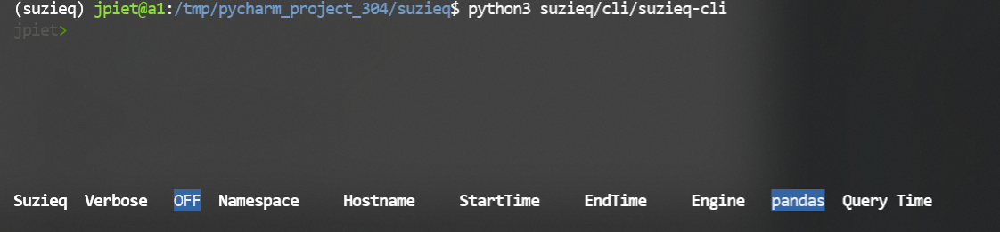
The words at the bottom show specific choices that you can make to filter data.

An important concept in Suzieq is the **namespace**. We were originally thinking
of namespace as datacenter, but it can be whatever grouping of devices that you want. At this point
Suzieq cannot build a hierarchy of namespaces. We will add some way to group namespaces together in 
the future.

To get started, it's often a good idea to look at the help. Just type a '?', 'help' or 'tab key' to get started:
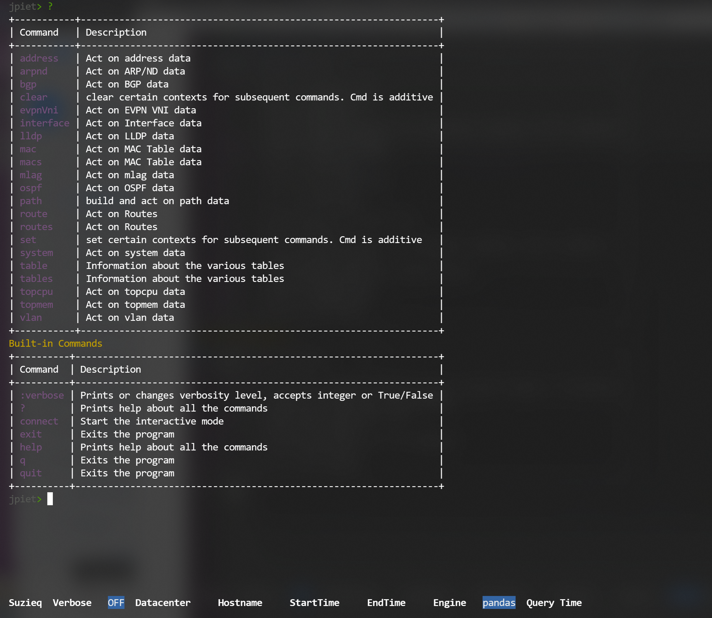
You will see the commands that you can use with Suzieq. For each command there are a few **verbs** 
and, some **filters** that you can add. Most commands have at least the 'show', 'summary', and 'unique' verbs; some 
commands have more.

Each command has completion to help you understand what you can do with the command. 
For instance, the 'interface' command shows that it has five verbs that you can use with it.
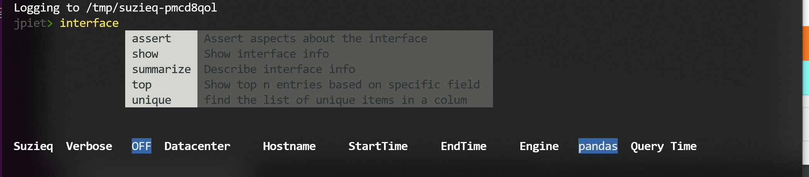

Let's look at some data. We'll start with the system data to get an overview of the devices
that we have data for. This shows that we have data from 14 devices and some information about each of the
systems. In this case, we have a single namespace, and it has some Cumulus Linux Routers, and some Ubuntu hosts.
```
device show
```
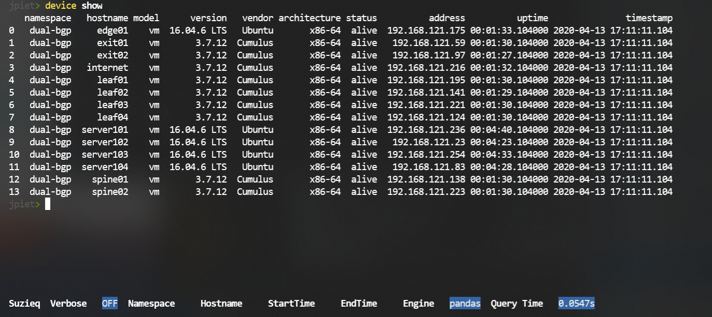

Another example of the same command, with Arista EOS devices. This is also a single namespace, with routers
and hosts.
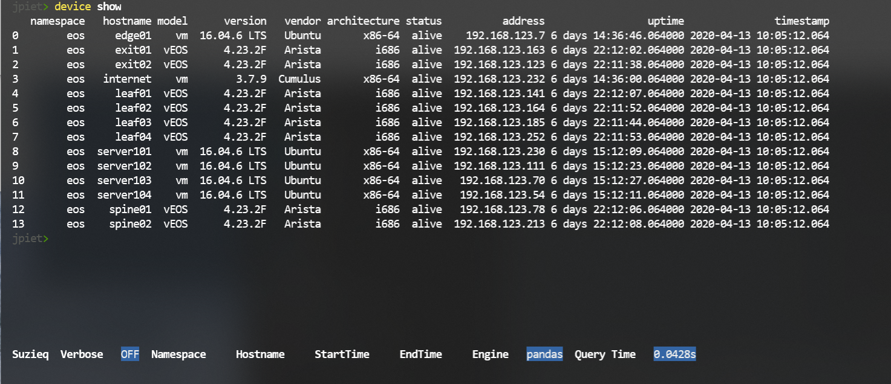

###  1.1. <a name='bgp-analysis-demo'></a>BGP Analysis Demo

Let's look at BGP data. We'll use this to demonstrate some of the things you can do with Suzieq.

We'll start with **bgp show**. You can see that Suzieq shows a row per connection of a device and it's peer. 
This command includes data such as the current state of the connection, asn, peer asn, and important statistics
such as the number of prefixes received, how long the connection has been established, and the number of
changes in the connection state. 
```
bgp show
```
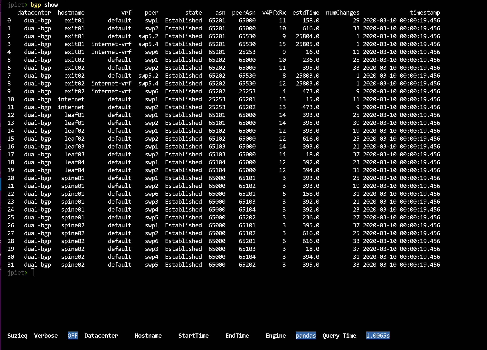

There's a lot of data there. One way to break out data for most commands is to use the **unique** verb. 
Unique shows the unique items for a column, and a count of each. In this example, we just want to 
look at the ASNs. Let's look at what the ASNs are and
how many there are of each. The 'unique' **verb** command requires that you use a 'columns=' **filter** to pick 
which of the **columns names** in the data you want to examine.
```
bgp unique columns=asn
```

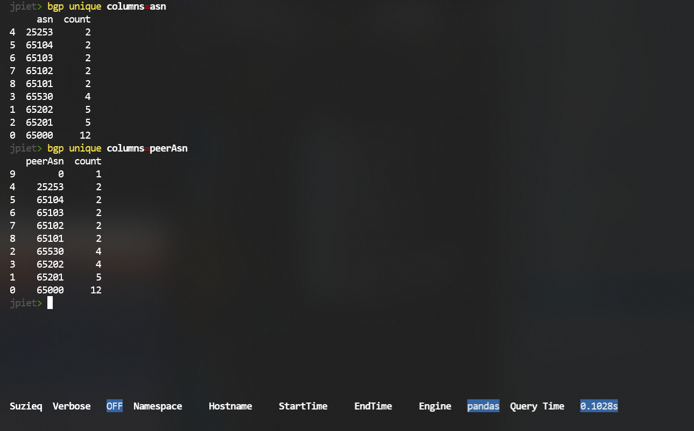

To get an overview of what is going on in a service, Suzieq has the verb 'summarize'.
To get an overview of BGP in your networks, Suzieq has the command 'bgp summarize'.
```
bgp summarize
```
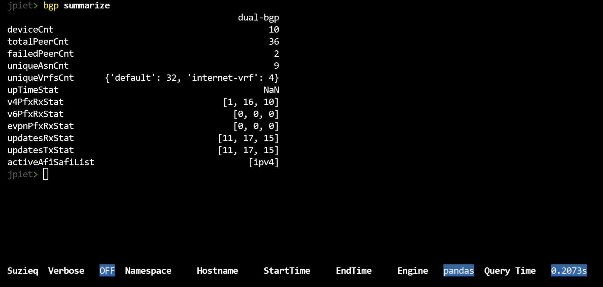 
This can be a bit intimidating, as Suzieq is summarizing a lot of information.
As you can see, there is a column per namespace, though in this example we only have one namespace. 
We list the number of
ASNs, peerAsns, etc. It shows the number of rows, which are the number of rows in the 
table if you had just done a 'bgp show'. For items that have a count of 3 or less,
it shows the entries, and how many there are of each. In this example network,
there are two VRFs, with 'default' having 32 rows and 'internet-vrf' having 4. If an item has has 
more than 3 that you'd 
like to examine, you can use the 'unique' verb as mentioned above. For instance, from summarize
 there are 9 ASNs. Using 'unique', as shown above, you can see each ASN and how many times it is being used.

Another interesting concept is shown in v4PfxRxStat, v6PfxRxStat, etc, which is if you see three numbers
in a list, then Suzieq is showing you min, max, and median. This is our best
way to help you understand the distribution that you have.

**Asserts** are a very important part of Suzieq. Asserts are quick checks based on the collected information. 
We have some interesting ones defined, 
but a lot more to add in the future. The following screen-shoot shows our **bgp assert** command. This run several
checks on the BGP data and shows which ones failed.
```
bgp assert
```
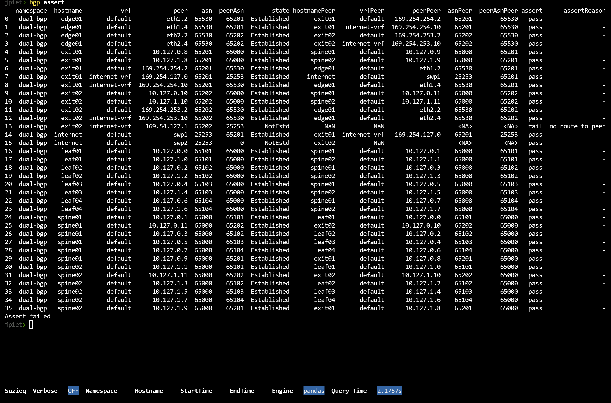
You might notice that there is a row entry per device and peer. There is then a lot of information
that is needed to run the checks in the assert. Finally, at the end there is an assert column with
pass or fail for each row, and if there is a fail, there is a list of reasons that the row failed. At the
very end is a message if the Assert passed or Assert failed. 


###  1.2. <a name='path-demo'></a>Path Demo
One of the nice things that we can do with Suzieq is show all the **different paths**
between two endpoints.
```
path show src='172.16.1.101' dest='172.16.4.104' namespace=dual-bgp
``` 
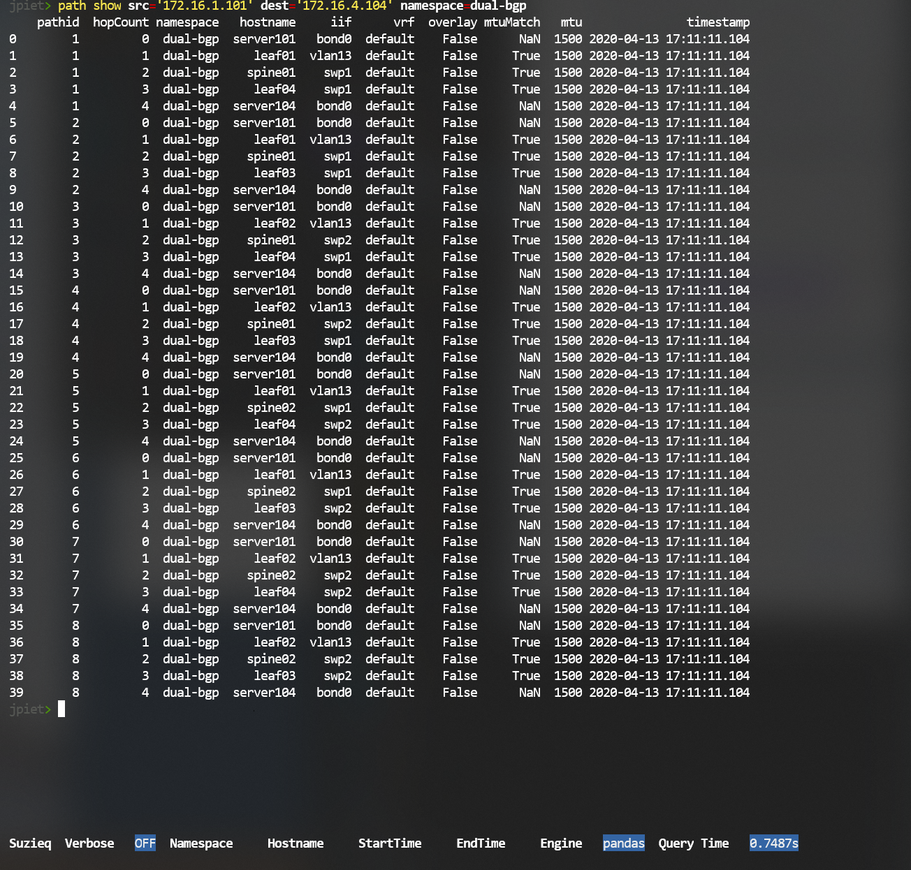 This is a little tricky 
to understand. In this example, there are eight different paths, represented
by their **pathid**. For each pathid, we then show each hop. As you can see,
we also show the mtu, and if it is an overlay.

Path does not yet work in all cases, but it works in most that we know of. Some EVPN cases do not work yet;
underlays + overlays are tricky.

One quirk of the libraries that Suzieq uses is that IP addresses
must be put in quotes or they won't work.

You can also get a **summary of the path** between two IP addresses:

```
path summarize src='172.16.1.101' dest='172.16.4.104' namespace=dual-bgp
```
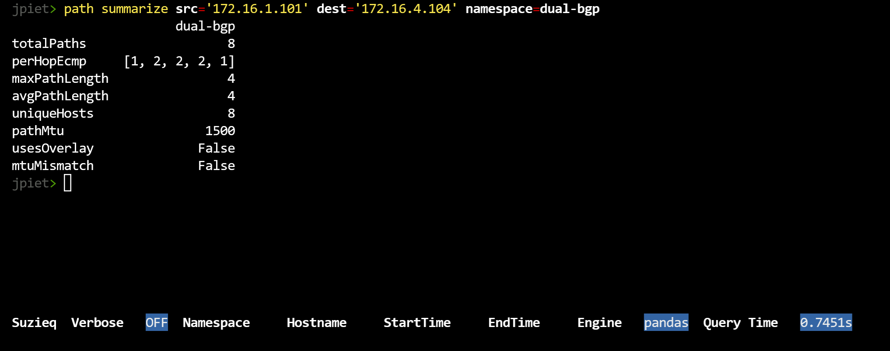

###  1.3. <a name='route-demo'></a>Route Demo

A quick peak at routes shows that there are 239 routes throughout the network.
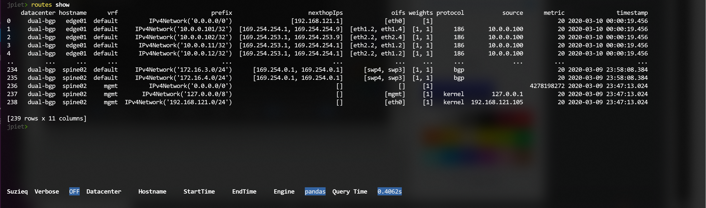

We'd like to see the number of routes per device. That and other things can be understood
from the summarize command. We can see that there are only 39 unique routes in the network.
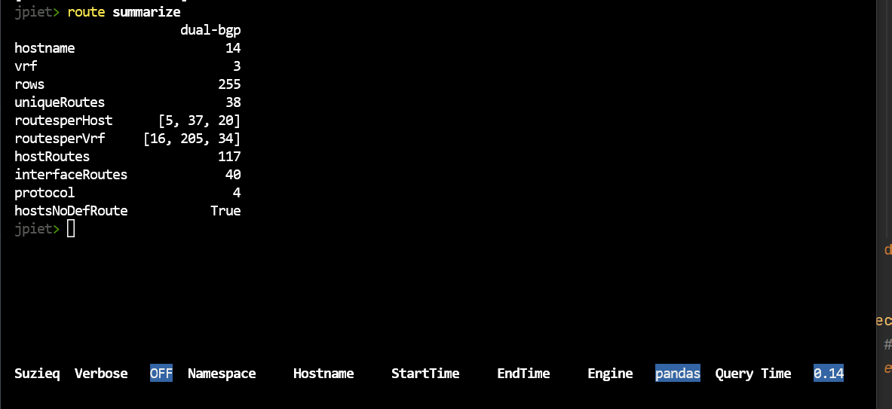

###  1.4. <a name='lpm-demo'></a>LPM Demo
Another nice attribute of Suzieq is that you can do an LPM match and see the results from each device.
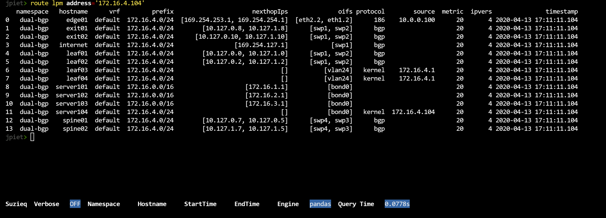

###  1.5. <a name='investigate-suzieq-tables'></a>Investigate Suzieq Tables

If you want to look at the database more directly, use the **table** command. There isn't always
a single connection between tables in the database and commands that are available. Also, we are 
collecting data in some tables, such as **ifCounters**, that do not yet have commands. 
We assume it's better to start getting data, and then we can add useful analysis as we go along.

To see each table in the database and some statistics about each one:
```
table show
``` 

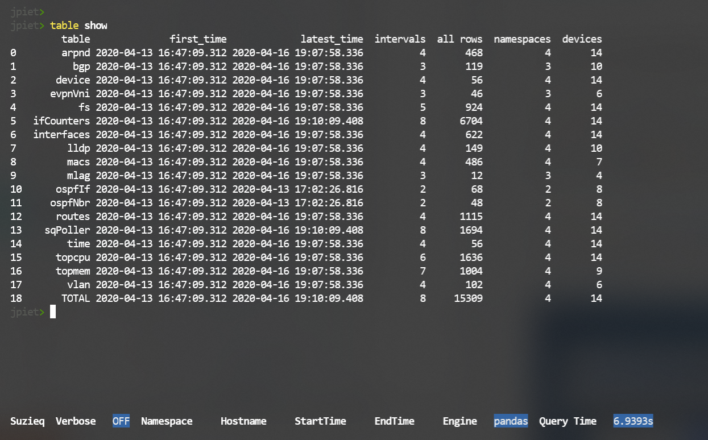
Suzieq only saves data to the database if there have been changes to the data. So some 
tables will iterate often, and some will not.

A special table called **sqPoller** (we have access through the CLI), 
records the work that Suzieq poller is doing. At this point it's probably only 
useful for developers.

For each table, you can look at what is in the data and what are the columns that are displayed automatically.
For instance, with BGP we collect a lot more data than we show by default. 

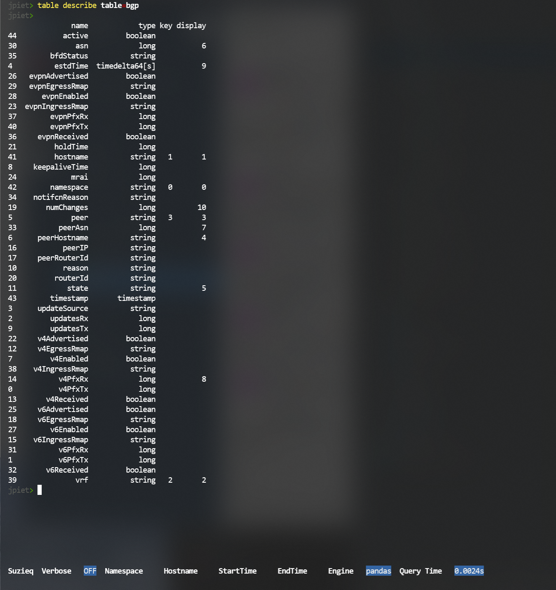
You can always display more columns by adding the columns filter at the end of a show command.
You can use 'columns=*' to get all the columns available for a command, but for BGP that is a lot!
`bgp show columns=*`

###  1.6. <a name='using-suzieq-on-the-command-line'></a>Using Suzieq on the command line
You can directly call a Suzieq command such as `suzieq-cli bgp summarize` directly from the CLI, 
and check the output of the command.
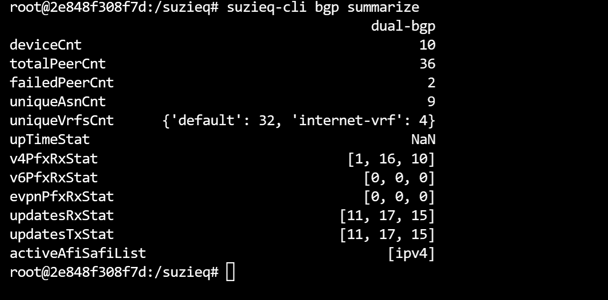

Based on the command you run, Suzieq will exit with interesting results. 
For instance, if you run an assert and it fails, you will get an exit code other than 0 (usually 255.)
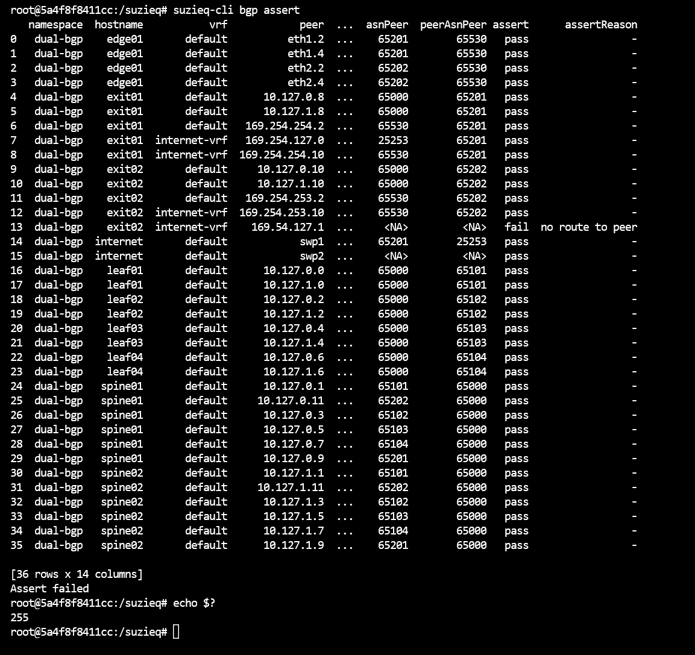


###  1.7. <a name='filtering'></a>Filtering
As shown above, the Suzieq cli works by commands (also called services), verbs, and filters. 
Some of the filters we've seen so far are 'columns' and 'namespace'. Different commands and verbs
have different filters. 

The standard filters that work on most command/verb pairs are:
 * hostname
 * start-time
 * end-time
 * view
 * namespace
 * format
 * columns
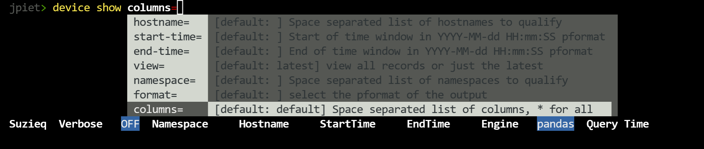

Most of those are self-explanatory. The default for view is 'latest', 
which means the most current change. 'view=all' will provide
the data across all time. 'view=changes' analyzes just the data
that has changed.

The filter 'format=' allows you to produce data other than in a pandas dataframe.
This is most useful at the command line to then read in the data 
from suzieq. Example: feed Suzieq output in another script in JSON format.


###  1.8. <a name='context-filtering'></a>Context Filtering
In the CLI you can set a specific context for filtering all the 
commands that you use. For instance, if you want to set a filter 
for the namespace that you will be investigating then you type
```
set namespace=dual-bgp
```
you can add or remove context filters as necessary.

###  1.9. <a name='how-time-works-in-suzieq'></a>How time works in Suzieq
By default when you use the CLI and you use a command, you will be using 'view=latest'. This is usually
the most useful and what you expect to see. If you want to see all your data, add 'view=all'. You can also select 
specific start and end times that you are interested in.

Suzieq also has the notion of seeing changes during a time window. If you specify a start-time and
and end-time and don't specify 'view=all', then you will see only the changes during a time window.

##  2 <a name='asserts'></a>Asserts
As demonstrated above, Suzieq has a powerful concept called Asserts. In an assert of service
some number of checks are made to ensure that the network is setup correctly. For each service that has an assert
you get an output that shows all the data necessary for the checks, a pass/fail column, and 
a reason column for any failed checks.

Also, as mentioned before, if you run an assert from your 
shell and check the return code, a failure of the assert will
be a non-zero value, usually 255.

###  2.1. <a name='bgp-assert'></a>BGP Assert
As shown above


The checks that are run in the BGP assert are:
 * outgoing link down
 * no route to peer
 * asn mismatch
 * not established -- it gets the error that the device reported 
in the notifcnReason

###  2.2. <a name='evpnvni-assert'></a>EvpnVni Assert
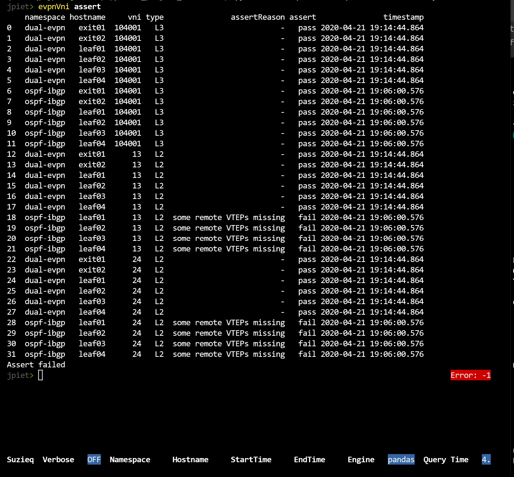

The checks in EvpnVni Assert are:
 * interface is down
 * some remote VTEPs missing
 * a VTEP is not reachable
 * a VTEP is reachable via default
 * HER is missing VTEPs

###  2.3. <a name='interface-assert'></a>Interface Assert
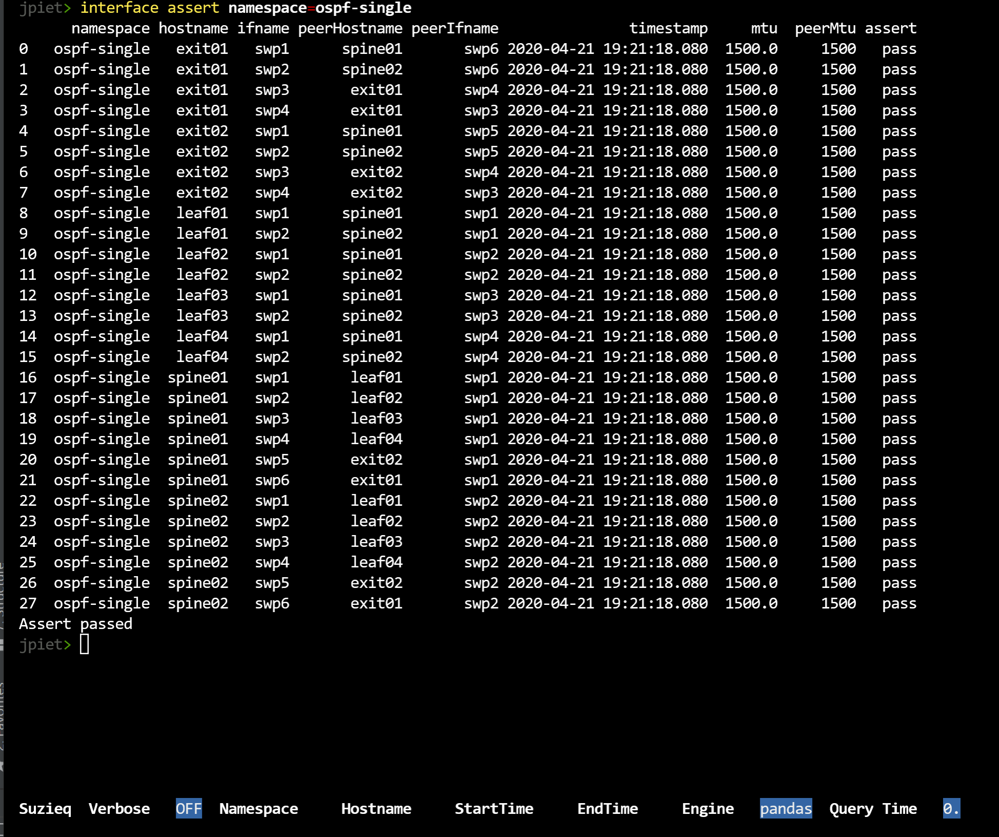

The checks in Interface Assert are:
 * MTU match on both sides of a connection

###  2.4. <a name='ospf-assert'></a>OSPF Assert
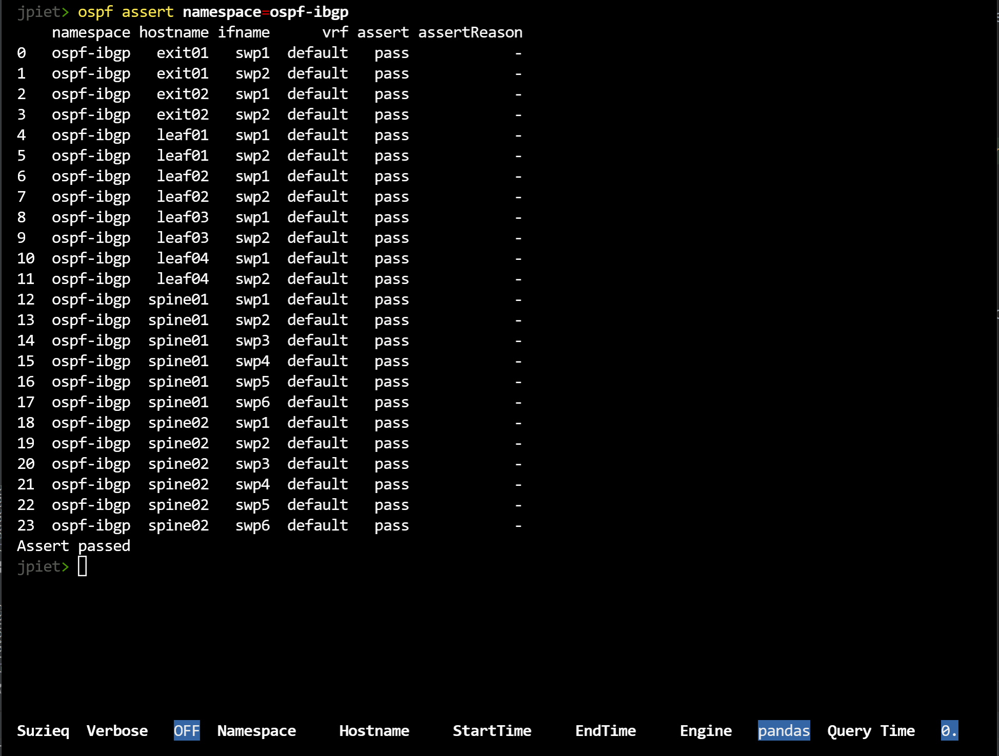

The cheks in OSPF Assert are:
 * duplicate routerId 
 * subnet mismatch
 * area mismatch
 * Hello timers mismatch
 * Dead timer mismatch
 * network type mismatch
 * passive config mismatch
 * vrf mismatch

##  3. <a name='summarize'></a>Summarize
###  3.1. <a name='todo'></a>TODO
