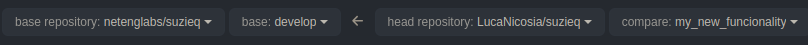

To add your functionality to SuzieQ, you need to follow some steps:

1. First of all, fork the SuzieQ repository and clone the forked project on your computer
2. Move into the `develop` branch using the command `git checkout develop`, create a new branch and move into it (`git checkout -b <NEW_BRANCH-NAME>`).

    Now you can start developing your new functionality for SuzieQ.

    !!!Info
        All the commits must be signed-off using the `-s` parameter of the git command.

    !!!Warning
        In case the newly developed code contains an enhancement or a new platform/service support, some tests have to be added:

        - any fix or enhancement SHOULD include relevant new tests or test updates, if any tests need updating.
        - a new platform support MUST include the relevant input files similar to what we have in tests/integration/sqcmds/-input directories, along with the relevant tests in the tests/integration/sqcmds/-samples dir. That list MUST include the all.yml file fully filled out.
        - any new service (or table) addition MUST include comments about what network OS are supported (along with version) with this command along with test samples for those platforms and input files in the *-input dir

3. Once you have done with coding (and testing), open a pull request from the forked github page.
   The target repository and base branch must be set respectively to `netenglabs/suzieq` and `develop`.

   

4. Click on the `Create pull request` and edit the template adding comments about your functionality.

Now PR is visible to the SuzieQ developers that will review your code as soon as possible.
