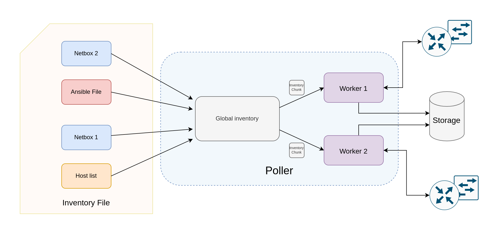

# Gathering Data: Poller

To gather data from your network, you need to run the poller. We support gathering data from Arista EOS, Cisco's IOS, IOS-XE, and IOS-XR platforms, Cisco's NXOS (N7K with versions 8.4.4 or higher, and N9K with versions 9.3.1 or higher), Cumulus Linux, Juniper's Junos(QFX, EX, MX and SRX platforms), and SoNIC devices, besides Linux servers

To start, launch the docker container, **netenglabs/suzieq:latest** and attach to it via the following steps:

```
  docker run -itd -v /home/${USER}/parquet-out:/suzieq/parquet -v /home/${USER}/<inventory-file>:/suzieq/inventory --name sq-poller netenglabs/suzieq:latest
  docker attach sq-poller
```

In the docker run command above, the two `-v` options provide host file/directory access to (I) store the parquet output files (the first `-v` option), and (II) the inventory file (the second `-v` option). The inventory file is the list of devices and their IP address that you wish to gather data from.

You then launch the poller via the command line:

```bash
  sq-poller -I inventory
```

The inventory file format is covered in the [inventory page](./inventory.md).

To monitor the status of the poller, you can look at the log files created (by default) in the `/tmp` directory. All the aspects related to the creation/update of the inventory are logged into `sq-poller-controller.log`, while the each worker logs into `sq-poller-<x>.log` where `x` is the worker id.

## <a name='poller-architecture'></a>Poller architecture

|
|:--:|
| Figure 1: Poller architecture  |

The poller is the component in charge of periodically collecting the data from the devices. The list of nodes to poll comes from multiple sources, which are specified in the inventory file, given to the poller as input. The node lists coming from the sources are collected into a single global inventory, which could be splitted into multiple chunks and assigned to a different _worker_, the component in charge of polling the devices. The number of workers to use can be specified via the `-w <n_workers>` argument. For example, the poller could be launched with 2 workers polling the devices:

```shell
sq-poller -I inventory -w 2
```

Some of the sources could be _dynamic_ (i.e. Netbox), this means that the node list might change in time. The poller is able to dynamically track these changes and to provide the new inventory chunks to the workers.

### Inventory chunking

The poller could use different policies for the inventory splitting. At the moment two are supported:

- `sequential`: in this case the inventory is splitted into `n` equal chunks, where `n` is the number of workers.
- `namespace`: nodes can be groupped into namespaces, for example the nodes inside the same namespace can be the devices inside the same data center. This option avoids that nodes from the same namespace end into different chunks. In order to have a worker for each namespace, the number of workers must be equal to the number of namespaces in the inventory.

!!! warning
    At the moment, when using the namespace policy, you should make sure that the number of workers is less or equal than the number of namespaces.

The chunking policy can be easily specified in the Suzieq configuration file via the `policy` field under chunker in poller:

```yaml
poller:
  chunker:
     policy: sequential
```

## <a name='gathering-data'></a>Gathering Data
Two important concepts in the poller are Nodes and Services. Nodes are devices of some kind;
they are the object being monitored. Services are the data that is collected and consumed by Suzieq.
Service definitions describe how to get output from devices and then how to turn that into useful data.

Currently Suzieq supports polling [Arista](https://www.arista.com/en/),
[Cisco's IOS](https://www.cisco.com/c/en/us/products/ios-nx-os-software/ios-technologies/index.html) including IOS Classic, IOS-XE and IOS-XR,
[Cisco's NXOS](https://www.cisco.com/c/en/us/products/switches/data-center-switches/index.html),
[Cumulus Linux](https://cumulusnetworks.com/),
[Juniper](https://www.juniper.net),
and [SONIC](https://azure.github.io/SONiC/) devices, as well as native Linux devices such as servers. Suzieq can easily support other device types, and we have third-party contributors working on other NOSes. Please let us know if you're interested in Suzieq supporting other NOSes.

Suzieq started out with least common denominator SSH and REST access to devices.
It doesn't care much about transport, we will use whatever gets the best data.
Suzieq does have support for agents, such as Kafka and SNMP, to push data and we've done some experiments with them, but don't
have production versions of that code.

## Debugging poller issues
There are two places to look if you want to know what the poller is up to. The first is the poller
log file in */tmp/sq-poller.log*. The second is in Suzieq in the sq-poller table. We keep data about how
polling is going in that table. If you do `suzieq-cli sqpoller show --status=fail` you should see any failures.

```
jpietsch> sqpoller show status=fail namespace=dual-evpn
     namespace   hostname  service  status gatherTime totalTime svcQsize wrQsize nodeQsize  pollExcdPeriodCount               timestamp
     18   dual-evpn     edge01     mlag     404         []        []       []      []        []                    0 2020-06-17 05:14:40.285
     257  dual-evpn  server101      bgp       1         []        []       []      []        []                    0 2020-06-17 05:14:40.980
     260  dual-evpn  server101  evpnVni       1         []        []       []      []        []                    0 2020-06-17 05:14:38.145
     271  dual-evpn  server101     mlag     404         []        []       []      []        []                    0 2020-06-17 05:14:38.792
     272  dual-evpn  server101   ospfIf       1         []        []       []      []        []                    0 2020-06-17 05:14:38.138
     273  dual-evpn  server101  ospfNbr       1         []        []       []      []        []                    0 2020-06-17 05:14:40.593
     284  dual-evpn  server102      bgp       1         []        []       []      []        []                    0 2020-06-17 05:14:41.712
     287  dual-evpn  server102  evpnVni       1         []        []       []      []        []                    0 2020-06-17 05:14:38.831
     298  dual-evpn  server102     mlag     404         []        []       []      []        []                    0 2020-06-17 05:14:39.121
     299  dual-evpn  server102   ospfIf       1         []        []       []      []        []                    0 2020-06-17 05:14:38.831
     300  dual-evpn  server102  ospfNbr       1         []        []       []      []        []                    0 2020-06-17 05:14:41.036
     311  dual-evpn  server103      bgp       1         []        []       []      []        []                    0 2020-06-17 05:14:40.980
     314  dual-evpn  server103  evpnVni       1         []        []       []      []        []                    0 2020-06-17 05:14:38.144
     325  dual-evpn  server103     mlag     404         []        []       []      []        []                    0 2020-06-17 05:14:38.792
     326  dual-evpn  server103   ospfIf       1         []        []       []      []        []                    0 2020-06-17 05:14:38.138
     327  dual-evpn  server103  ospfNbr       1         []        []       []      []        []                    0 2020-06-17 05:14:40.594
     338  dual-evpn  server104      bgp       1         []        []       []      []        []                    0 2020-06-17 05:14:40.980
     341  dual-evpn  server104  evpnVni       1         []        []       []      []        []                    0 2020-06-17 05:14:38.145
     352  dual-evpn  server104     mlag     404         []        []       []      []        []                    0 2020-06-17 05:14:38.792
     353  dual-evpn  server104   ospfIf       1         []        []       []      []        []                    0 2020-06-17 05:14:38.830
     354  dual-evpn  server104  ospfNbr       1         []        []       []      []        []                    0 2020-06-17 05:14:40.980
```
In this case the errors are because we aren't running any of those services on these nodes.


## Database and Data Persistence

Because everything in Suzieq revolves around [Pandas](https://pandas.pydata.org/) dataframes, it can support different persistence engines underneath. For right now, we only support our own, which is built on [Parquet](https://parquet.apache.org/) files.
This is setup should be fast enough to get things going and for most people. It is also self contained and fairly simple.
We have tried other storage systems, so we know it can work, but none of that code is production worthy. As we all gain experience we can figure out what the right persistence engines are One of the advantages is that the data are just files that can easily be passed around. There is no database code that must be running before you query the data.
