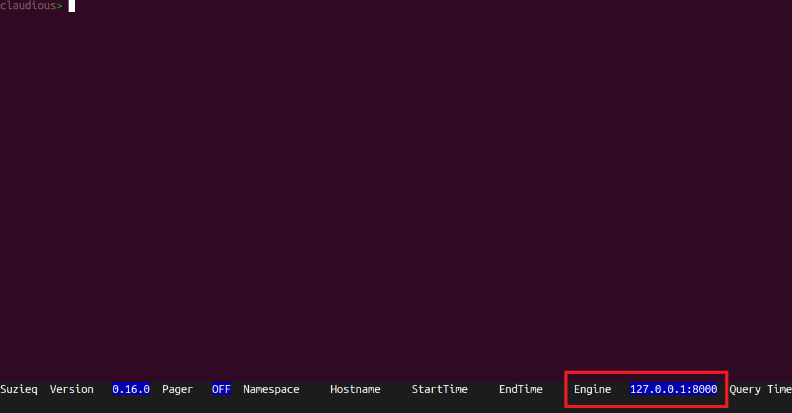

## Accessing remote data

From version 0.16.0, the cli can be used on a local machine while parquet data is stored remotely. To achieve that, the REST server should be running in the node where the parquet data is stored. Then the Suzieq configuration should be updated to enable the remote data access.

In case you don't have a Suzieq REST server running yet, follow the [guide](./rest-server.md).

Both for the Suzieq REST server and CLI you can use the same configuration file. You will need to add just 2 lines at the bottom of the configuration file to enable remote data access:

```yaml
ux: 
  engine: rest
```

!!! warning
    In case you are running the REST server behind an Ingress (i.e. Kubernetes) check that the fields `address` and `port` match the url you use to reach the REST server.

If you are using the docker container to use the CLI you need to mount the new configuration file inside the container. To do so:
```bash
docker run -it -v suzieq-cfg.yml:~/.suzieq/suzieq-cfg.yml
```

If you are using Suzieq as a Python package, place the configuration file in the folder where you launch the cli  `suzieq-cfg.yml` or, for a global configuration, in `~/.suzieq/suzieq-cfg.yml`.

Now you can run the Suzieq CLI:
```bash
suzieq-cli
```

If everything went well, at bottom of the screen, in the CLI, you will see the ENGINE set to the address and port of the remote REST server.

|
|:--:|
| Figure 1: Engine value when remote access is enabled  |