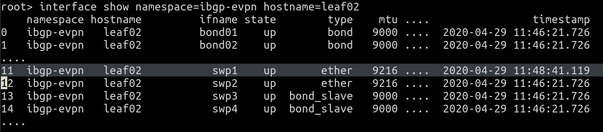
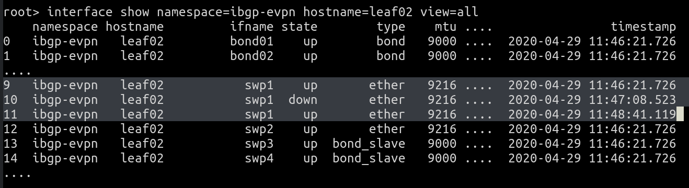
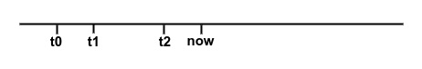
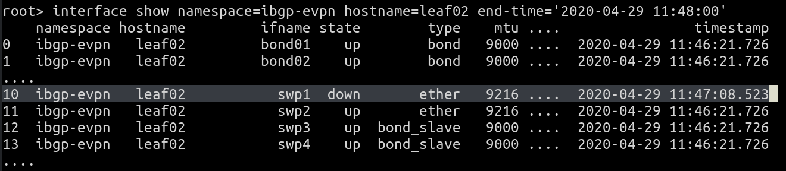
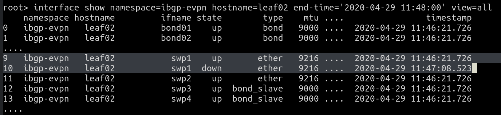
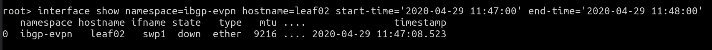
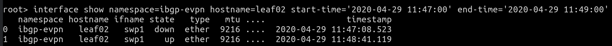

Time, time, time, see what's become of me, while I looked around for my possibilities
                                                                - *Simon & Garfunkel*

One of the powerful features of Suzieq is the ability to observe the state of the network at a time in the past, or to play back changes in state in a specified time window. This post explains how to use time in the various commands in the Suzieq CLI. Along with this, this post also explains how Suzieq treats time internally.

To briefly summarize what you can do with time in Suzieq CLI:
- Suzieq can either display only the values as of a particular time (called **snapshot**), or all the records in a time window (called **changes**)
- By default, with no time specification, the output of a table shows the latest snapshot
- You can also see the snapshot of a table as of a specific time
- You can view all the changes in a table in a specific time window

Lets see this in practice.

## Examples of Using Time in Suzieq

We use the suzieq-demo docker container for all the commands. You can run this with the command: `docker run -it netenglabs/suzieq-demo`. Inside the container, type `suzieq-cli` to get into the CLI.

Lets start with a listing of the interfaces in the ibgp-evpn namespace. The output of `interface show namespace=ibgp-evpn hostname=leaf02` looks as shown in Figure 1. The output in this figure and the remaining figures have been snipped to focus on the fields that matter. 

|
|:--:|
| Figure 1: Interface Listing |
	
Lets try and make sense of this output. When it comes to analyzing the data, Suzieq provides two different perspectives on using time, as described earlier. The first is what we call **snapshot**, and the second is what we call **changes**. A snapshot, as the name suggests, is the view of the resource **at** a particular time. By default, when no time is specified with a command, Suzieq assumes the *latest* snapshot. 

But you can choose to view more than just the current state. You can find out all the changes in state upto the present moment. For this, use the **view=all** option. `interface show namespace=ibgp-evpn hostname=leaf02 view=all` results in the display shown in Figure 2. Since no time specification was provided, it lists all records upto the present time.

|
|:--:|
| Figure 2: Interface Listing, View All Records |

As highlighted in the figure, interface swp1 shows three records, of a transition down and then up. To explain all this more a litte more clearly, consider the sample timeline shown Figure 3 below.

|
|:--:|
| Figure 3: Timeline to illustrate Use of Time |

When we executed the first command above, at the time marked "now" in Figure 1, we expected to see the state of all interfaces as of that time. The last change to swp1 happened at time t2. t2 for the output we're discussing is the time "2020-04-29 11:48:41.119". So this is what the output in Figure 1 showed. But swp2 had no change since time t0, which is "2020-04-29 11:46:21.176" in the figure. So, the state of swp2 was as shown at time t0. Thus, we note that Suzieq only stores data when there is a change to the previous state. When we used view=all, the output showed all the changes to swp1: the initial record at t0, the link down at t1 and the link up at t2. 

The next thing you can do in Suzieq w.r.t. time is to provide a time at which you want the snapshot. Specifying an end-time of '2020-04-29 11:48:00' results in the display shown in Figure 4. We see that the interface shows up as being down, because that was the final state of the interface as of time 11:48:00. This output is what happens when we ask for the state as of a time between t1 and t2. In our case, we used the time "2020-04-29 11:48:00" which is before time t2. The output indicates that interface swp1 was down at this time. 

|
|:--:|
| Figure 4: Interface Listing, Snapshot with Specific Time |

Suzieq only accepts time in the format of "YYYY-MM-DD hh:mm:ss" today. We'll be adding support for time expressed in more human terms such as "10 min ago" or "10 pm last night" in the next release.

As before, for the same snapshot, using view=all shows all the changes upto the point specified by end-time. This output is shown in Fig 5.

|
|:--:|
| Figure 5: Interface Listing, View All Records Upto Snapshot Time |

Next, to only see the records that changed in a time window, use both start-time and end-time. For the same command, the command `interface show namespace=ibgp-evpn hostname=leaf02 start-time='2020-04-29 11:47:00' end-time='2020-04-29 11:48:00' produces the output shown in Figure 6.

|
|:--:|
| Figure 6: Interface Listing, View Changes in Time Window |

And the final picture is to increase the time window and see all the transitions associated with interface swp1.

|
|:--:|
| Figure 7: Interface Listing, View Chages in Longer Time Window |

Today, only the show option supports the use of time. We'll be adding support for the other commands in the next release.

Having examined the use of time to either see the state of the network at a particular point in time or the set of changes in a time window, lets now go behind the scenes to see how Suzieq associates time with state. Specifically, when we used "2020-04-29 11:48:00", what does that time represent?

## Time in Data Capture
Every record that is stored has a timestamp associated with it. Suzieq's poller pulls the data from the devices its configured to gather data from. So the time recorded is from the perspective of the poller. Specifically, the poller records the time at which the result of executing a command on the remote node is received by the poller. So, if the poller fires a command at time t0, and the reply data is received at time t0+7 seconds, the timestamp associated with the record is t0+7. The timestamp uses the UTC timezone. Thus, in our example outputs, the time "2020-04-29 11:48:41.119" represents the time at which that data was received by the poller for the node leaf02.

Suzieq only saves a record if it has changed compared to what was received in the previous poll interval. If nothing has changed, the result of the current poll period is not saved. Thus, Suzieq saves the data the very first time data is received for a service (bgp, routes etc.). After that, it only saves the data if something does change from this previously received data. 

Suzieq takes specific care to ensure that the data is consistently saved in the face of valid changes. Consider the case where the data returns certain fields that can change across every poll. Examples of such fields include uptimes and protocol state changes when a session is not up (transitioning between Active, Connect and Idle in case of BGP, for example). Without handling these cases, Suzieq would end up saving data every poll interval because the uptime or the failed protocol state is constantly changing. Uptimes are converted into a timestamp so that it doesn't change every poll interval. Protocol state is stored as either up or down (Established or NotEstd in case of BGP), ignoring various states of down. Next, if a node reboots, its uptime changes. The poller detects this change and throws away the in-memory, previously saved record for all services associated with the node. This in turn causes the poller to save all the data again for that node. The last part of handling changing data is w.r.t counters. If Suzieq is saving counters of any sort, say interface counters, the schema associated with the service marks the service as a counter. For 'counter' services, data is saved every poll interval instead of trying to check if any change has occurred.

## Summary

To recap, Suzieq provides two kinds of time-based perspectives. One is called the snapshot which shows the state as of a particular time. The other is to show all changes in a given time window. Using the view=all option, you can see all the changes upto the specified time (or current time if no time is specified). Depending on the task you want to accomplish, you can decide which option you want to use. For example, you can use the changes option to produce a daily (or twice a day or any other period) report of the things that have changed. 
