# 10ish ways to explore your network with Suzieq

[Suzieq](https://github.com/netenglabs/suzieq) is new software for Network Observability. In 
this blog I will be going over some of the things you can do with Suzieq to help you explore 
and understand your network. We have [suzieq-data ](https://github.com/netenglabs/suzieq-data) 
that you can use to investigate Suzieq. This databases has data from all the 
different scenarios available in 
[https://github.com/netenglabs/cloud-native-data-center-networking](https://github.com/netenglabs/cloud-native-data-center-networking)

We are going to go through specific things you can do with Suzieq, to give 
you good ideas of how you can start using it in your network. We will cover 
more topics in other blog posts, such as 
[asserts](https://github.com/netenglabs/suzieq/blob/master/docs/analyzer.md#asserts) 
which are a powerful way to have Suzieq check that you have a healthy network.

All my examples in this post are [Cumulus Linux](https://cumulusnetworks.com/) 
because it is by far the easiest Network OS to run virtually to try these experiments out. 
Suzieq analysis does not care what OS it’s working on.

## Namespaces and Devices

**Namespaces are the way to group devices in Suzieq.** These groups allow 
analysis of devices together. Namespaces also allow overlapping device names 
between namespaces. When you configure the sq-poller to collect information from 
your devices you decide which devices are in which namespace. To see the namespaces 
ou have in a Suzieq database:

```
device unique columns=namespace
```

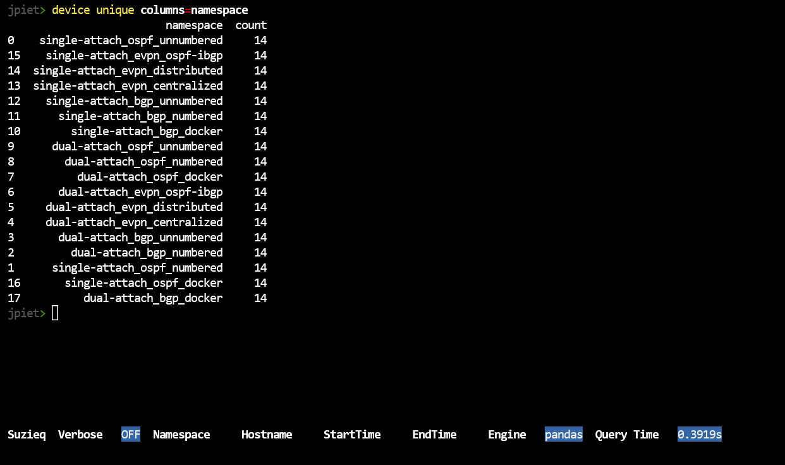

This also demonstrates the way that the suzieq-cli works. We have different 
objects (also called commands) just as device, then we have verbs for the objects 
(such as unique) and then filters for the object/verb pairing. **Most of the 
commands have a standard 
set of verbs, which are ‘show’, ‘summarize’, and ‘unique’**. 
‘unique’ requires the ‘columns=’ filter to find the unique entries in 
a column and the count of the number of times that the entry occurs.

To see all the commands, type:

    ?


Let’s continue by looking at the data we have in the database. To see 
hosts in a namespace

    device unique columns=hostname namespace=single-attach_bgp_numbered

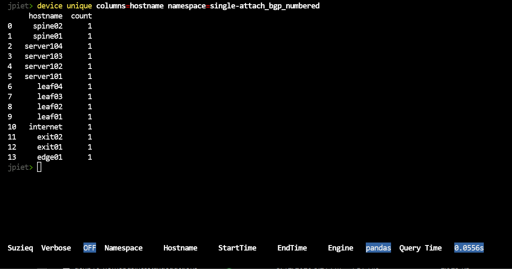

You can also look to see more information about the devices that you have.

    device show namespace=single-attach_bgp_numbered


**The show verb is the most basic verb Suzieq has, showing the data directly**. 
It displays a lot of information for the command. For each command Suzieq has a 
default set of columns that are displayed, but you can choose to display less or 
display more, using the ‘columns=’ filter. ‘columns=default’ gives this default view, 
‘columns=*’ displays all the columns and ‘columns=’col1 col2' would display the col1 and col2 columns.

You can see how many columns and what are the defaults using the ‘table describe’ command.

    table describe table=device

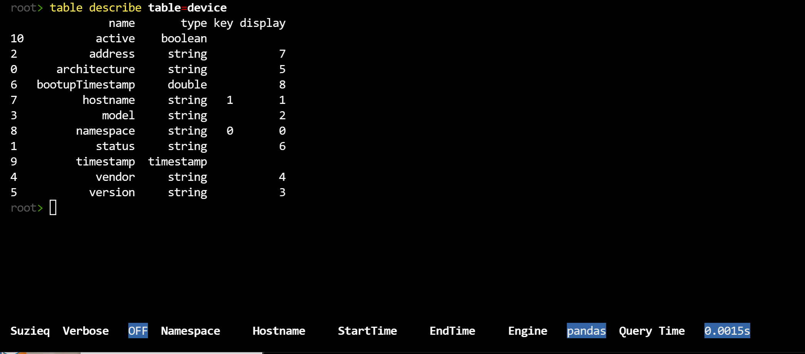

You can see which of the columns are shown by default and which additional columns are stored. 
In the case of device, almost all the columns are shown. In some cases, there are many columns 
not shown. BGP currently has 50 columns that could be shown.

## BGP

Now that we have a little bit of understanding of what data we have, let’s dive into one 
namespace. Let’s start with an overview of BGP.

    bgp summarize namespace=single-attach_bgp_numbered


In any of our summaries, statistics that end with Cnt, such as uniqueVrfCnt, if there are three 
or less of them, then we break out the items and provide their count. In this example, there are 2 
uniqueVrfsCnts, which are default and internet-vrf. Statistics that end with Stat, such as 
upTimesStat, shows lists of three items bracketed in [] show [min, max, median] of the values 
to give you an overview of the distribution. For any of these values, you can use the ‘unique’ 
verb to dive into the column and see the whole list.

For instance, notice that there are 2 session that have failed, let’s see what those are.

    bgp show namespace=single-attach_bgp_numbered status=fail

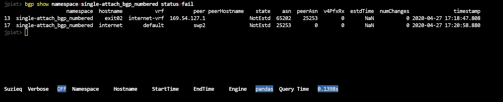

Let’s see what else we can find out about these two failed sessions. FRR (which is used by Cumulus Linux) 
and Arista EOS both sometimes support reason codes when they have failed sessions. Let’s use the column 
filter to see if we can find the reason.

    bgp show namespace=single-attach_bgp_numbered columns='namespace hostname vrf peer state reason notifcnReason lastDowTime'

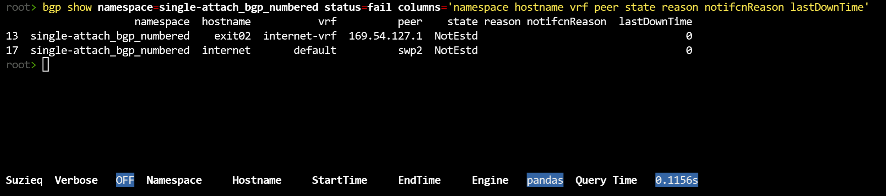

No, that didn’t work this time. However, it is interesting that the lastDownTime is 0. 
That means it’s never established correctly. Ok, let’s try bgp assert. In other blog posts 
we’ll cover assert more thoroughly, but to understand this problem let’s try it.

    bgp assert namespace=single-attach_bgp_numbered

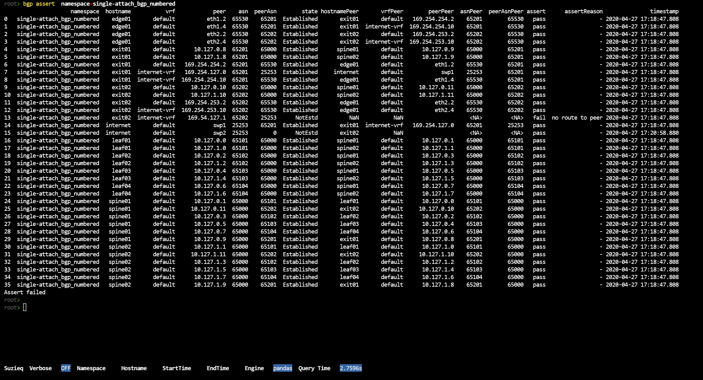

So that’s a lot of output. We’d like to filter on just those that failed, Suzieq doesn’t 
have an option for that yet, so I just filed an [issue](https://github.com/netenglabs/suzieq/issues/118).

Here’s a screen shot of just those two (plus an extra).

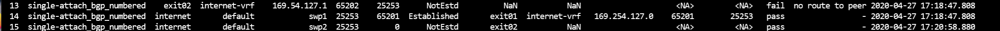

We can see that the first one failed because of no route to peer. The second doesn’t 
give us an assert failure, however you’ll notice that the first failure is exit02 to 
169.54.127.1 and the second one is the internet device trying to connect to exit02. 
So this is probably each direction of the same failed BGP connection.

We also want to understand what the ASNs are. Dive into the ASNs and Peer ASNs

    bgp unique columns=asn namespace=single-attach_bgp_numbered
    bgp unique columns=peerAsn namespace=single-attach_bgp_numbered

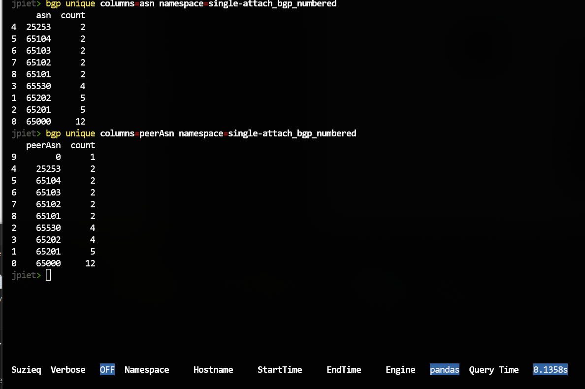

One mysterious thing is what is peerAsn 0? From above, that is one of the failed BGP 
sessions. You also might notice the counts columns. These are the counts of BGP 
sessions for each of the ASNs.

## Routes

Let’s now take a look at the route command. We’ll start with summarize.

    route summarize namespace=single-attach_bgp_numbered

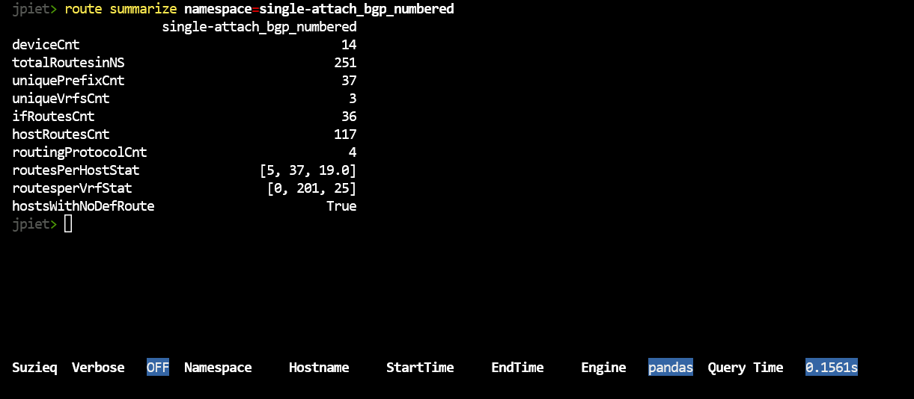

This has data like we saw in ‘bgp summarize’, and we want to dive into what 
these mean. This shows the routes for each device summed together. Let’s use 
unique to dive in. What are the Vrfs in your network?

    route unique columns=vrf namespace=single-attach_bgp_numbered


This shows a bug we have in Suzieq right now, where evpn-vrf is not in this 
namespace but it is showing up with a count of 0. That count is correct, we 
shouldn’t even be displaying evpn-vrf. We’ll fix it soon, but this is where we are right now.

Another thing you might like to look at is which devices have no default route, 
ince the summarize showed hostsWithNoDefRoute = 2. Suzieq doesn’t provide a way to do that at this time.

Let’s move to looking at protocols, as you notice, we have four protocols.

    route unique columns=protocols namespace=single-attach_bgp_numbered

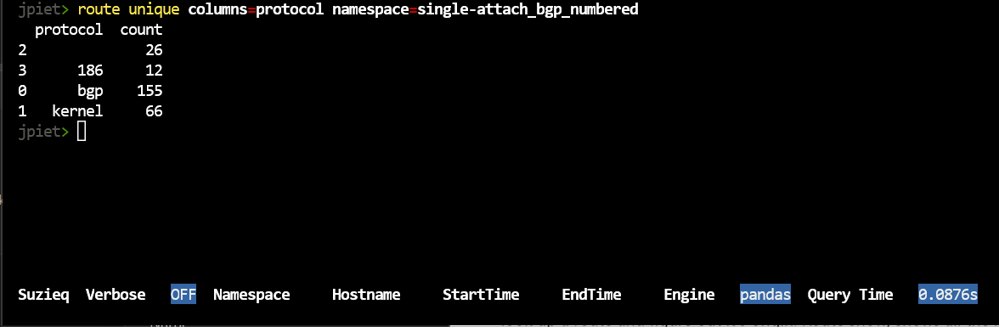

These might look mysterious to you. These are consequences of using Cumulus Linux as 
well as Ubuntu 16.04. Blank protocols are usually DHCP or mgmt interfaces. Kernel routes are connected interfaces or static routes.

I’ll just look up protocol 186. You can look up the others.

    route show namespace=single-attach_bgp_numbered protocol=186

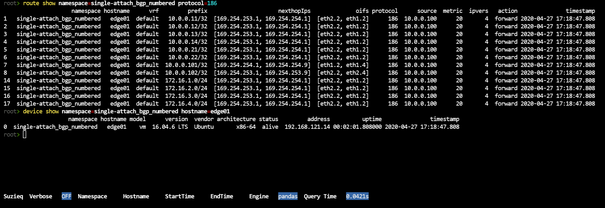

I can log into a Cumulus Linux device and look up 186, and it’s BGP. I think the this 
version of Ubuntu doesn’t read that and report the protocol as BGP.

    vagrant@edge01:~$ more /etc/iproute2/rt_protos.d/frr.conf 
    # Additional protocol strings defined by frr for each of its daemons  
    186  bgp 
    187  isis 
    188  ospf 
    189  rip 
    190  ripng 
    191  nhrp 
    192  eigrp 
    193  ldp 
    194  sharp 
    195  pbr 
    196  static 
    197  openfabric

With so many routes, it’s good to be able to dive in. One way is to see what 
routes are available using filtering by prefixlen.

    route show namespace=single-attach_bgp_numbered prefixlen="<=16"


We’d also like to see where an address comes from look. Route show, shows all the 
routers that this is valid on. Address show shows the origin.

    route show namespace=single-attach_bgp_numbered prefix='172.16.253.1' 
    address show namespace=single-attach_bgp_numbered prefix='172.16.253.1'

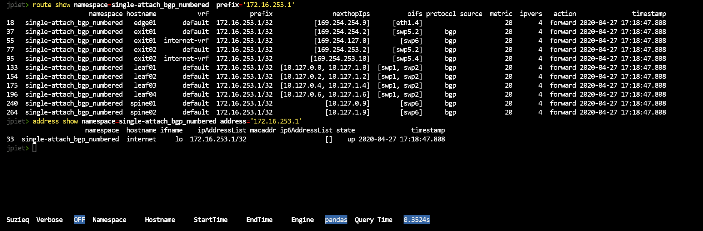

I’d also like to see all the addresses in a subnet. H ow do I see all the address in 172.16.4.0/24?

    route show namespace=single-attach_bgp_numbered prefix='172.16.4.0/24' 
    address show namespace=single-attach_bgp_numbered address='172.16.4.0'

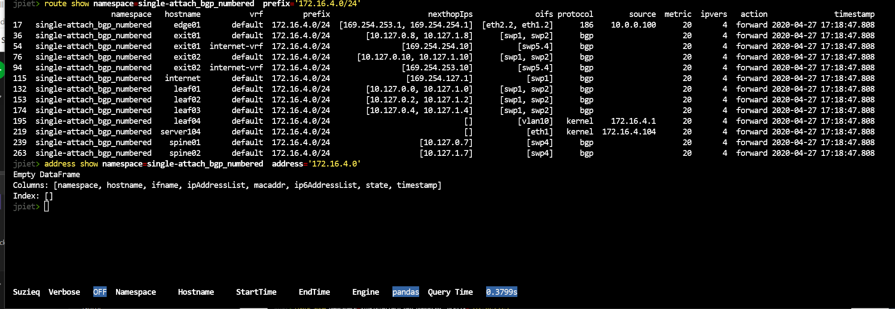

Nope. Suzieq can’t do that yet. I’ve created [an issue](https://github.com/netenglabs/suzieq/issues/117) 
for that, let us know in comments on that issue if you also want that added sooner than later.
